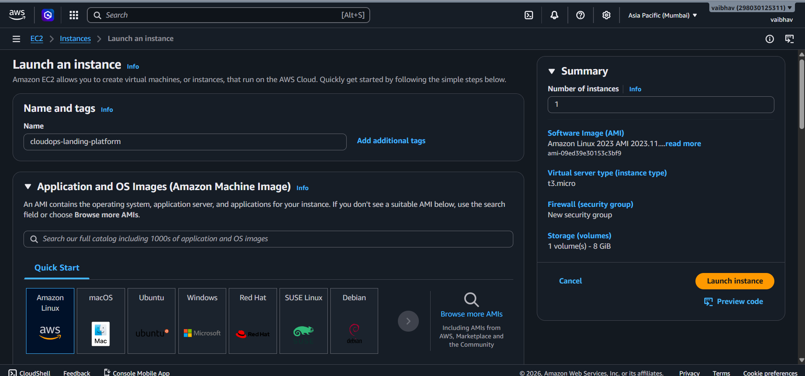
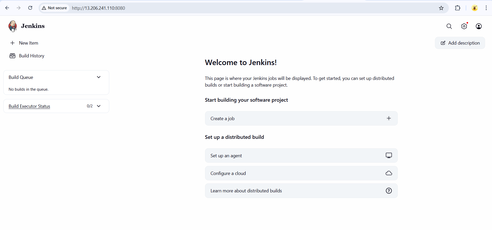
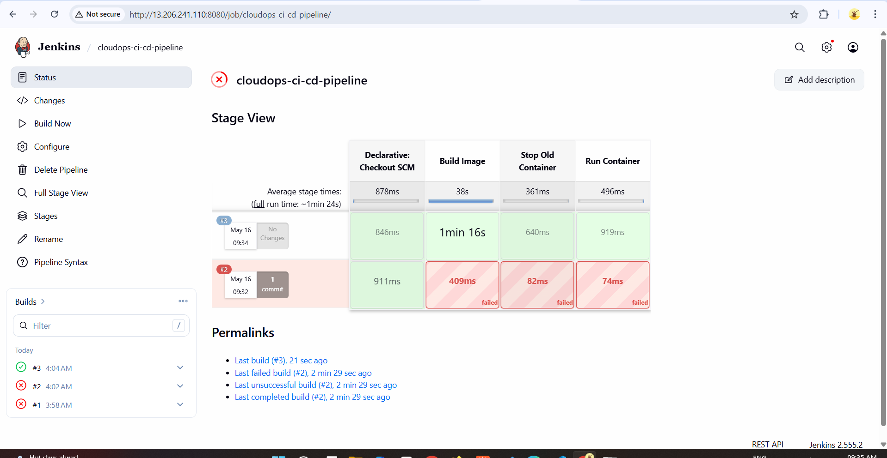
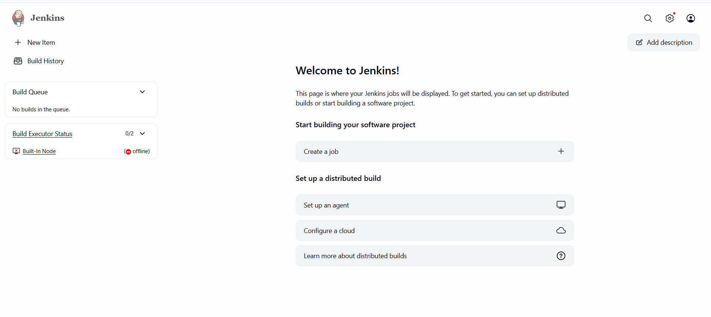
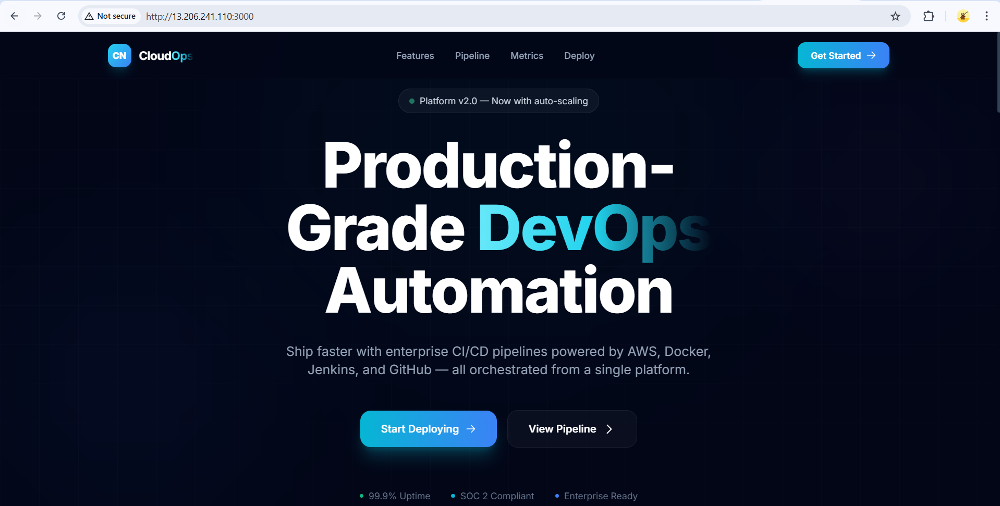

# 🚀 Production-Ready React CI/CD Pipeline via Jenkins & Docker on AWS

An automated, cloud-native CI/CD pipeline built on AWS EC2 using Amazon Linux 2023. This setup automates the process of pulling a modern React application from GitHub, building a lightweight Docker container image, and serving it dynamically on port `3000`.

---

## 🧱 System Architecture

```text
GitHub (Code Push) ──> Jenkins (EC2 Server) ──> Docker Build ──> Live React Container (:3000)
```

---

## ☁️ Step 1 — Launch AWS EC2 Instance

- **AMI:** Amazon Linux 2023
- **Instance Type:** t3.micro (or t2.micro)
- **Storage:** 20 GB Root Volume (gp3)

**Security Group Inbound Rules:**

| Port | Protocol | Source           | Purpose                |
| ---- | -------- | ---------------- | ---------------------- |
| 22   | TCP      | My IP / Anywhere | SSH Remote Access      |
| 8080 | TCP      | Anywhere         | Jenkins Dashboard      |
| 3000 | TCP      | Anywhere         | React Live Application |

---

## ⚙️ Step 2 — Server Configuration & Prerequisites

Connect to your instance via SSH:

```bash
ssh -i your-key.pem ec2-user@YOUR_PUBLIC_IP
```

### 1. Update OS Package Manager

```bash
sudo dnf update -y
```

### 2. Install Git & Java 21 (AWS Corretto)

```bash
sudo dnf install git java-21-amazon-corretto -y
```

### 3. Install & Configure Docker Daemon

```bash
sudo dnf install docker -y
sudo systemctl start docker
sudo systemctl enable docker

# Enable ec2-user to run Docker commands without sudo
sudo usermod -aG docker ec2-user
newgrp docker
```

---

## 🚀 Step 3 — Install & Configure Jenkins

### 1. Add Jenkins Repository and Keys

```bash
sudo wget -O /etc/yum.repos.d/jenkins.repo https://pkg.jenkins.io/redhat-stable/jenkins.repo
sudo rpm --import https://pkg.jenkins.io/redhat-stable/jenkins.io-2023.key
```

### 2. Install and Start Jenkins Engine

```bash
sudo dnf install jenkins -y
sudo systemctl enable jenkins
sudo systemctl start jenkins
```

### 3. 🛑 CRITICAL: Grant Jenkins Permissions to Run Docker

For Jenkins to successfully run Docker builds during pipelines, the `jenkins` system user must belong to the `docker` group:

```bash
sudo usermod -aG docker jenkins
sudo systemctl restart jenkins
```

---

## 🌐 Step 4 — Initialize Jenkins UI

Open your browser and navigate to:

```
http://YOUR_PUBLIC_IP:8080
```

Fetch the administrator unlock password from the server terminal:

```bash
sudo cat /var/lib/jenkins/secrets/initialAdminPassword
```

Paste the key, select **Install Suggested Plugins**, and set up your admin user profile.

Go to **Manage Jenkins → Plugins → Available Plugins**, look up and install the following:

- **Docker Pipeline**
- **Pipeline: Stage View**

---

## 📦 Step 5 — Project Codebase Files

Ensure the following configuration files are situated directly within the **root directory** of your project repository:

### `Dockerfile`

```dockerfile
FROM node:18-alpine
WORKDIR /app
COPY package*.json ./
RUN npm install
COPY . .
EXPOSE 3000
CMD ["npm", "start"]
```

### `.dockerignore`

```
node_modules
build
.git
```

### `Jenkinsfile`

```groovy
pipeline {
    agent any

    environment {
        APP_NAME = "cloudops-landing-page"
        CONTAINER_NAME = "cloudops-frontend-container"
    }

    stages {
        // Jenkins automatically checks out your main branch into the workspace here

        stage('Build Image') {
            steps {
                sh "docker build -t ${APP_NAME} ."
            }
        }

        stage('Stop Old Container') {
            steps {
                sh "docker stop ${CONTAINER_NAME} || true"
                sh "docker rm ${CONTAINER_NAME} || true"
            }
        }

        stage('Run Container') {
            steps {
                sh """
                docker run -d \
                --name ${CONTAINER_NAME} \
                -p 3000:3000 \
                ${APP_NAME}
                """
            }
        }
    }
}
```

---

## ⚙️ Step 6 — Orchestrate the Jenkins Job

1. On the Jenkins dashboard, click **New Item**.
2. Enter `cloudops-ci-cd-pipeline`, choose **Pipeline**, and hit **OK**.
3. Scroll down to the **Pipeline** section and configure:
   - **Definition:** Pipeline script from SCM
   - **SCM:** Git
   - **Repository URL:** `https://github.com/YOUR_USERNAME/YOUR_REPO_NAME.git`
   - **Branch Specifier:** `*/main`
   - **Script Path:** `Jenkinsfile`
4. Click **Save**, then trigger the deployment by hitting **Build Now**.

---

## 🌍 Verification

Once all execution stages show green bars in the Jenkins Stage View UI, access the running frontend app at:

```
http://YOUR_PUBLIC_IP:3000
```

---

---

## 📸 Screenshots

### ☁️ EC2 Instance Running on AWS



### 🌐 Jenkins Dashboard



### ✅ Jenkins Build — All Stages Passed



### ❌ Built-In Node Offline Error



### 🌍 React App Live on Port 3000



---

---

## 🛠️ Troubleshooting

### ❌ Built-In Node Shows "Offline" — Disk Space Below Threshold

**Symptom:** Jenkins dashboard shows `Built-In Node → (offline)` and builds refuse to run.

**Root Cause:** Jenkins continuously monitors disk space on `/tmp`. When free space drops below the default threshold of **1 GB**, Jenkins automatically marks the executor as offline to prevent failed builds.

**Error you will see in Jenkins:**

```
Disk space is below threshold of 1.00 GiB.
Only 973.48 MiB left on /tmp
```

---

#### ✅ Fix — Increase /tmp RAM Disk Size

**Step 1 — Check current disk usage:**

```bash
df -h
```

**Step 2 — Temporarily increase `/tmp` to 2GB:**

```bash
sudo mount -o remount,size=2G /tmp
```

**Step 3 — Verify the change applied:**

```bash
df -h
```

**Step 4 — Make it permanent (survives reboots):**

```bash
sudo nano /etc/fstab
```

Find the `/tmp` line and update it to:

```
tmpfs /tmp tmpfs defaults,noatime,size=2G 0 0
```

Save and exit: `Ctrl+X` → `Y` → `Enter`

**Step 5 — Remount with new settings:**

```bash
sudo mount -o remount /tmp
```

**Step 6 — Restart Jenkins:**

```bash
sudo systemctl restart jenkins
```

**Step 7 — Refresh the Jenkins UI.** The Built-In Node should come back online automatically.

> 💡 If it's still offline after restarting, go to:
> **Manage Jenkins → Nodes → Built-In Node → Click "Mark this node online"**

---

#### 🧹 Optional — Free Up Disk Space

Run these commands to reclaim space safely without resizing `/tmp`:

```bash
# Clean DNF package cache
sudo dnf clean all

# Remove old system logs (older than 3 days)
sudo journalctl --vacuum-time=3d

# Remove unused Docker images, containers, and networks
docker system prune -af
```

> ⚠️ Only run `docker system prune -af` if you don't need any cached Docker images — it removes everything unused.
